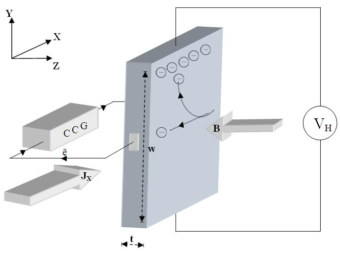

## Theory 

  If a current carrying conductor is placed in a perpendicular magnetic field, a potential difference will generate in the conductor which is perpendicular to both the magnetic field and the current. This phenomenon is called <strong>Hall Effect</strong>.

  In solid state physics, Hall effect is an important tool to characterize materials, especially semiconductors. It directly determines both the sign and density of charge carriers in a given sample.

  Consider a rectangular conductor of thickness <em>t</em> kept in the XY plane. An electric field is applied in the X-direction using a Constant Current Generator (CCG), so that current <em>I</em> flows through the sample. If <em>w</em> is the width of the sample and <em>t</em> is the thickness, then the current density is given by:

$$J_x=\frac{I}{wt}...........(1)$$

  <strong>Fig. 1:</strong> Schematic representation of Hall Effect in a conductor.

    <strong>CCG</strong> – Constant Current Generator 
    <strong>JX</strong> – Current density 
    <strong>e⁻</strong> – Electron 
    <strong>B</strong> – Applied magnetic field 
    <strong>t</strong> – Thickness 
    <strong>w</strong> – Width 
    <strong>VH</strong> – Hall voltage 

  If the magnetic field is applied along the negative z-axis, the Lorentz force moves the charge carriers (say electrons) toward the y-direction. This results in the accumulation of charge carriers at the top edge of the sample. This sets up a transverse electric field <em>Ey</em> in the sample. The resulting potential difference along the y-axis is known as the Hall voltage <em>VH</em>, and this effect is called the <strong>Hall Effect</strong>.

  A current is made to flow through the sample material, and the voltage difference between its top and bottom is measured using a voltmeter. When the applied magnetic field <em>B = 0</em>, the voltage difference will be zero.

  We know that a current flows in response to an applied electric field, with its direction considered conventional. It may be due to the flow of holes in the direction of current or electrons moving in the opposite direction. In both cases, under the influence of a magnetic field, the magnetic Lorentz force

  <em>Fm = q (v × B)</em>

  causes the carriers to curve upward. Since the charges cannot escape from the material, a vertical charge imbalance builds up. This imbalance produces an electric field which counteracts the magnetic force, and a steady state is established. The vertical electric field can be measured as a transverse voltage difference using a voltmeter.

  In steady-state conditions, the magnetic force is balanced by the electric force. Mathematically, we express this as:

$$eE=evB........(2)$$

  Where <em>e</em> is the electric charge, <em>E</em> is the Hall electric field developed, <em>B</em> is the applied magnetic field, and <em>v</em> is the drift velocity of charge carriers.

  And the current <em>I</em> can be expressed as:

$$I=neAv..............(3)$$

  Where <em>n</em> is the number density of electrons in the conductor of length <em>l</em>, breadth <em>w</em>, and thickness <em>t</em>.

  Using equations (1) and (2), the Hall voltage <em>VH</em> can be written as:

$$V_H = E w = v B w = \frac{I B}{n e t}$$

$$V_H = R_H \frac{I B}{t}..........(4)$$

by rearranging eq(4) we get

$$R_H = \frac{V_H \cdot t}{I \cdot B}...........(5)$$

Where RH is called the Hall coefficient.

$$R_H=\frac{1}{ne}..............(6)$$

